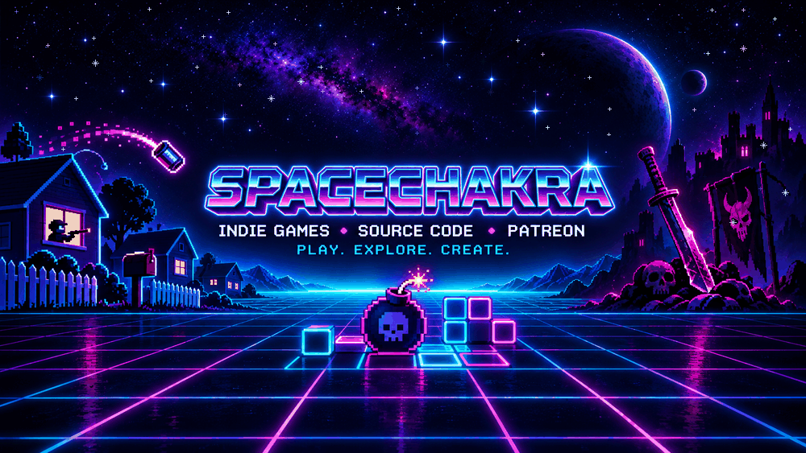

  

# Santiago Salvador / SpaceChakra

  

I'm a **designer who builds browser games and creative tools**: arcade combat, space shooters, music instruments, and experiments with sound. SpaceChakra is where I bring game design, code, art, and music together. I also explore NES game development. Everything below has a place you can play or try it.

### Play the games

| Game | What you'll find | Play |
| --- | --- | --- |
| [Zoe Force](https://github.com/WolfgangHendrix/zoeforce) | A six-stage browser shoot-'em-up with 2D and voxel views. **Public source.** | [Play](https://zoeforce.vercel.app) |
| Bone Cleaver | A weapon-based arena fighting game. | [Play the alpha](https://spacechakra.itch.io/bone-cleaver) |
| Vector Interceptor 2600 | Manual missile defense meets tower defense on a neon CRT grid. | [Play](https://spacechakra.itch.io/vectorinterceptor2600) |
| Road Trip Racer | A two-button hill racer made for kids. | [Play](https://road-trip-racer.vercel.app/hcrr.html) |

### Use the tools

| Tool | What it does | Try it |
| --- | --- | --- |
| [Charango Tuner](https://github.com/WolfgangHendrix/Charango_Tuner_Ecuador_SpaceChakra) | Tunes an Andean charango and provides folkloric metronome rhythms. | [Open](https://spacechakra.itch.io/charango-tuner-pro-ecuador) |
| [Cosmic Vibes](https://github.com/WolfgangHendrix/cosmic-vibes-chakra-alignment) | Generates Solfeggio tones and binaural beats in the browser. | [Open](https://spacechakra.itch.io/cosmic-vibes-chakra-alignment) |

More experiments are in the [SpaceChakra arcade](https://spacechakra.com) and on [itch.io](https://spacechakra.itch.io). I also share [art and free retro game replacement labels](https://github.com/WolfgangHendrix/santiagosalvador.com).

### Stack & tools

**Build**

  

  &nbsp;
  

**Create**

  &nbsp;
  &nbsp;
  &nbsp;
  &nbsp;
  

**AI coding tools**

  &nbsp;
  &nbsp;
  &nbsp;
  

### Around the web

[SpaceChakra](https://spacechakra.com) · [YouTube](https://www.youtube.com/@spacechakra) · [itch.io](https://spacechakra.itch.io) · [Patreon](https://patreon.com/spacechakra) · [Contact](mailto:salvsantiago@gmail.com)
